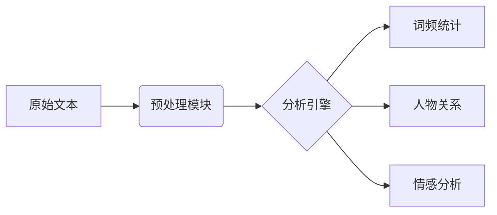

# 红楼梦文本分析系统说明

## 系统架构

## 核心流程

1. 数据采集：从古籍扫描件中提取文本
2. 清洗规则：
   - 去除现代标点符号
   - 保留原文章节标记（如「第 XX 回」）
3. 分析模块：
   - 基于 Jieba 的自定义词典
   - 人物称谓映射表（宝玉=贾宝玉）

## 运行要求

- Python 3.8+
- Conda 环境（参考环境管理指南）
- 内存：8GB 以上
- 存储空间：1GB 可用空间
